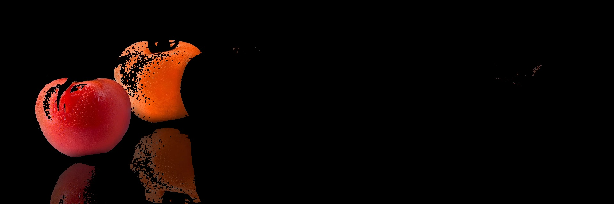

# Computer Vision Task 1 : 빨간색 검출 필터

이 프로젝트는 OpenCV를 활용하여 이미지 내에서 특정 색상(빨간색) 영역만 추출하는 작업을 수행합니다.

---

## 주요 기능

* **HSV 색상 공간 변환** : 빛의 세기에 민감한 BGR 방식 대신 색상 정보가 뚜렷한 HSV 방식 사용
* **이중 마스킹** : 빨간색은 HSV 색상환에서 0도와 180도 근처에 걸쳐 있으므로 두 개의 범위를 합쳐 검출
* **비트 연산** : 생성된 마스크를 원본 이미지에 적용하여 빨간색 영역만 필터링

## 파일 구조

* `image-processing/src/color\_filter.py` : 이미지 처리 메인 스크립트
* `image-processing/data/sample.jpg` : 분석에 사용된 원본 이미지

---

## 실행 방법

1. 관련 라이브러리 설치 :
```bash
pip install opencv-python numpy
```
2. 스크립트 실행 :
```bash
# src 폴더로 이동 후 실행
cd src
```
> **주의** : 현재 코드는 `src` 폴더 안에서 실행하는 것을 기준으로 경로가 설정되어 있습니다.

---

## 결과 화면

