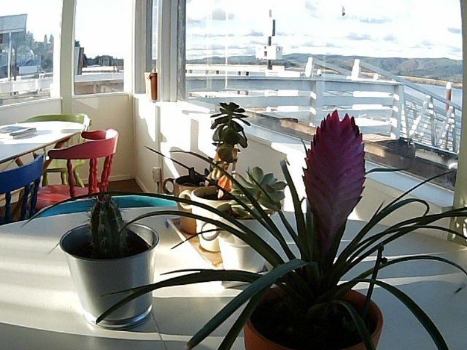
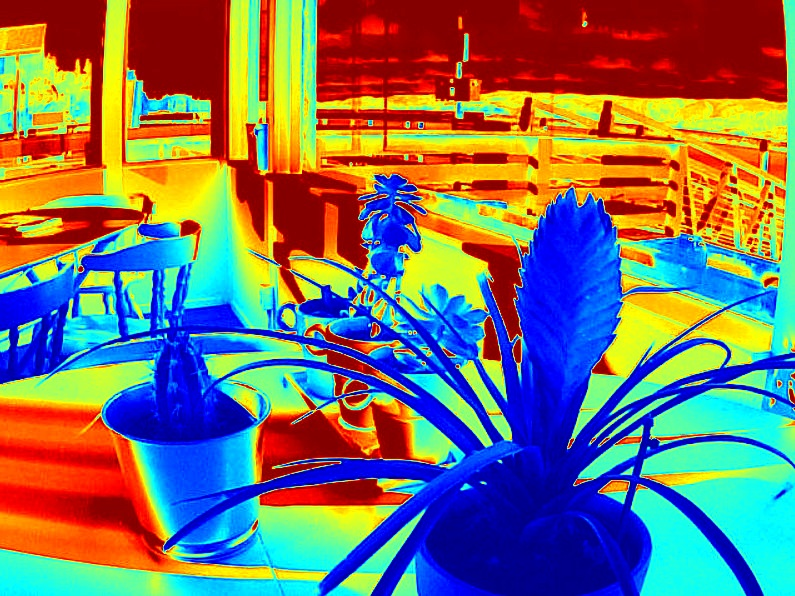

# Computer Vision Task 2 : Unit Test 구성 2D → 3D 변환 실습

이 프로젝트는 2D 이미지의 밝기 정보를 활용하여 Depth Map을 생성하고, 이를 3D Point Cloud 및 Face 데이터로 변환하여 `.obj` 파일을 생성합니다. 또한 `pytest`를 통해 코드의 안정성을 검증합니다.

---

## 주요 기능

* **테스트 자동화 (Pytest)** : `pytest`를 사용하여 출력 데이터의 크기 및 타입이 유효한지 자동으로 검증
* **Depth Map 생성** : 입력 이미지의 픽셀 밝기를 분석하여 거리 정보를 담은 깊이 맵 생성
* **3D 좌표 변환 (Point Cloud)** : 이미지의 (x, y) 좌표와 깊이 정보 (z)를 결합하여 3차원 공간 좌표 생성
* **Vertex Color 적용** : 원본 이미지의 색상 데이터를 RGB로 변환하여 각 3D 점에 입힘 (v x y z r g b 형식)
* **Mesh 생성 (Face)** : 인접한 점들을 삼각형 단위로 연결하여 입체적인 면 구조 형성

## 파일 구조

* `unit_test_2D_to_3D/src/depth_map.py` : 이미지로부터 깊이 맵을 생성하는 함수 소스 코드
* `unit_test_2D_to_3D/src/main.py` : 3D 변환 실행 및 `.obj` 파일 저장, 테스트 코드가 포함된 메인 파일
* `unit_test_2D_to_3D/data/sample.jpg` : 3D 변환 테스트를 위한 원본 샘플 이미지
* `unit_test_2D_to_3D/output/result_depth.jpg` : 시각화된 깊이 맵 결과 이미지
* `unit_test_2D_to_3D/output/result_3d.obj` : 최종 생성된 3D 메쉬 파일 (3D 뷰어로 확인 가능)

---

## 실행 방법

1. 관련 라이브러리 설치 :
```bash
pip install numpy opencv-python pytest
```
2. 소스 코드 실행 :
```bash
# src 폴더로 이동 후 실행
python main.py
```

---

## 결과 화면

* 원본


* Depth Map


* 3D 시각화
: 생성된 `result_3d.obj` 파일을 3DViewer.net 등의 온라인 뷰어에 업로드하여 확인합니다.

* 깊이 분석
: 현재는 밝기 기반 역산 방식을 사용하므로 조명과 재질에 따라 실제 거리와 오차가 발생할 수 있습니다.

* 기술적 대안
: 더욱 정확한 측정을 위해 **MiDaS (AI 모델)**나 **LiDAR / ToF 센서** 활용, 또는 **기하학적 분석 (소실점 계산)** 방식을 고려할 수 있습니다.